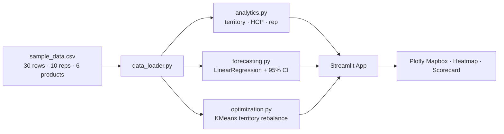

# Pharma Sales Territory Analyzer

[](https://streamlit.io)
[](https://www.python.org)
[](./LICENSE)
[](https://github.com/achmadnaufal/pharma-sales-territory-analyzer/commits)

Streamlit dashboard for **pharma sales territory analysis** in Indonesia — HCP coverage, prescription volume trends, territory optimization, and rep performance ranking.

## Architecture



## Quick Start

```bash
# 1. Install dependencies
pip install -r requirements.txt

# 2. Run the Streamlit app
streamlit run app.py

# 3. Open the browser
# Streamlit will auto-open http://localhost:8501
```

## Features

- **Territory Map** — Interactive Plotly Mapbox with coverage-ratio color scale across Indonesian provinces.
- **HCP Coverage Matrix** — Visit heatmap per HCP × product with under-covered-HCP flagging.
- **Prescription Trend Forecasting** — Linear-regression forecast with 95% confidence band (1–12 months).
- **Rep Performance Scorecard** — Revenue rank, coverage %, avg script value, workload balance score.
- **Territory Optimization** — KMeans clustering of HCP geography to propose rebalanced territories.

## Usage

Quick CLI sanity check against the bundled dataset:

```bash
python -c "from src.data_loader import load_sales_data; \
from src.analytics import territory_summary, rep_scorecard, under_covered_hcps; \
df=load_sales_data('demo/sample_data.csv'); \
print(territory_summary(df).sort_values('revenue_idr', ascending=False).head().to_string(index=False)); \
print('Under-covered HCPs:', len(under_covered_hcps(df, 7)))"
```

Real captured output:

```
Loaded 30 rows | 10 reps | 10 territories | 6 products

Territory summary (top 5 by revenue):
territory            city         province  revenue_idr  prescriptions  visits  hcp_count  coverage_ratio
 T-SBY-01        Surabaya       Jawa Timur   78900000.0            111      24          3           0.800
 T-PLM-01       Palembang Sumatera Selatan   75800000.0            139      28          4           0.875
 T-JKT-01 Jakarta Selatan      DKI Jakarta   62500000.0            125      23          3           0.767
 T-SMG-01        Semarang      Jawa Tengah   53100000.0             92      20          3           0.741
 T-MDN-01           Medan   Sumatera Utara   49800000.0            110      21          3           0.875

Rep scorecard (top 5 by revenue):
rep_id      rep_name territory  revenue_idr  coverage_pct  avg_script_value  rank_revenue
  R003   Agus Wibowo  T-SBY-01   78900000.0          80.0          710811.0             1
  R010 Teguh Prakoso  T-PLM-01   75800000.0          87.5          545324.0             2
  R001  Budi Santoso  T-JKT-01   62500000.0          76.7          500000.0             3
  R009   Lina Kusuma  T-SMG-01   53100000.0          74.1          577174.0             4
  R005  Rudi Hartono  T-MDN-01   49800000.0          87.5          452727.0             5

Under-covered HCPs (<7 visits): 9
```

See [`docs/SCREENSHOTS.md`](docs/SCREENSHOTS.md) for page-by-page descriptions.

## Tech Stack

- **Streamlit** — UI and interactivity
- **Pandas** — Data aggregation and transformation
- **Plotly** — Interactive maps, heatmaps, charts
- **Scikit-learn** — Linear regression forecasting + KMeans clustering
- **pytest** — Test suite (5 test files, 40+ tests)

## Project Structure

```
pharma-sales-territory-analyzer/
├── app.py                      # Streamlit entry point
├── src/
│   ├── __init__.py
│   ├── data_loader.py          # CSV loading + filtering
│   ├── analytics.py            # Territory / rep / HCP aggregations
│   ├── forecasting.py          # Linear-regression monthly forecast
│   └── optimization.py         # KMeans territory clustering
├── demo/
│   └── sample_data.csv         # 30 rows of Indonesian sample data
├── tests/
│   ├── conftest.py
│   ├── test_data_loader.py
│   ├── test_analytics.py
│   ├── test_forecasting.py
│   ├── test_optimization.py
│   └── test_integration.py
├── docs/
│   └── SCREENSHOTS.md          # Page-by-page view descriptions
├── requirements.txt
├── LICENSE                     # MIT
└── README.md
```

## Testing

```bash
pytest -q
```

## License

MIT — see [LICENSE](./LICENSE).

---

> Built by [Achmad Naufal](https://github.com/achmadnaufal) | Lead Data Analyst | Power BI · SQL · Python · GIS
